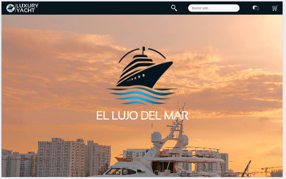
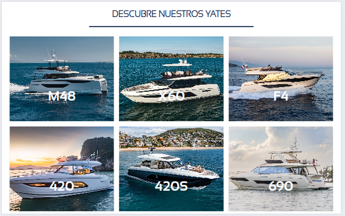
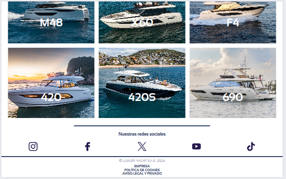
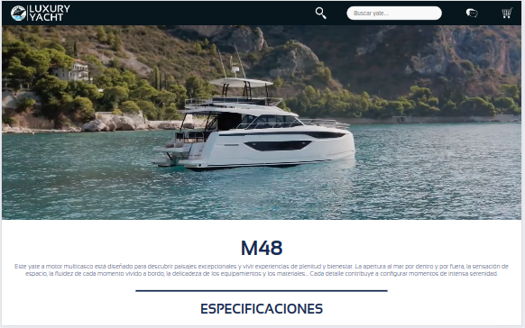
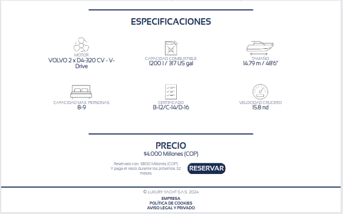
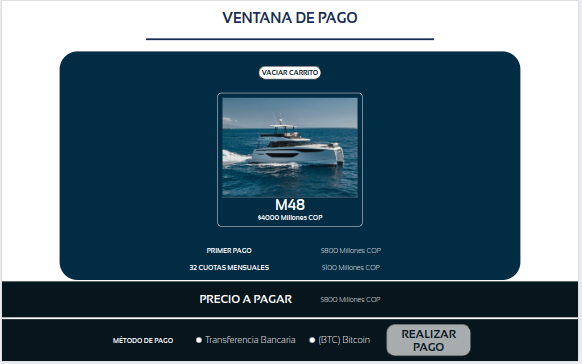

# Luxury Yacht Website

Este repositorio contiene el código fuente del sitio web Luxury Yacht, diseñado para mostrar y vender yates de lujo.

## Capturas de Pantalla

### Página Principal

### Página de Yate

### Página de Carrito de Compras

## Visión General

El sitio web Luxury Yacht permite a los usuarios explorar una variedad de yates de lujo y realizar compras en línea. Cuenta con secciones detalladas para cada modelo de yate, información técnica, precios y un carrito de compras integrado.

## Especificaciones Técnicas

- **HTML5**
- **CSS3**
- **JS**

## Uso

1. Clona este repositorio:
git clone https://github.com/nicolasm9808/PROYECTO-LUXURYYACHT_MENDEZLUIS

2. Abre `index.html` en tu navegador web.

## Diseño Realizado

- Utilización de colores elegantes y fotografías de alta calidad para resaltar la experiencia de lujo.
- Diseño responsivo para adaptarse a dispositivos móviles y de escritorio.

### Diseño Inicial Realizado

## Instalación

No se requiere instalación adicional más allá de un navegador web estándar.

## Contribución

1. Fork del repositorio.
2. Crea una nueva rama (`git checkout -b feature/Mejora`).
3. Realiza cambios y haz commit (`git commit -am 'Añade mejoras'`).
4. Push a la rama (`git push origin feature/Mejora`).
5. Abre un Pull Request.

## Estructura del proyecto
luxury-yacht/
├── Capturas/
├── Diseño/
├── Fuentes/
├── Recursos/
├── index.html
├── yate.html
├── carrito.html
├── index.js
├── yate.js
├── carrito.js
├── styles.css
├── README.md

## Autor👨‍💻

> Luis Nicolás Méndez
- Email : 		nicolas-mendez@hotmail.com
- LinkedIn : 	https://www.linkedin.com/in/luis-nicol%C3%A1s-m%C3%A9ndez-palacios-935047233/
- GitHub :		https://github.com/nicolasm9808