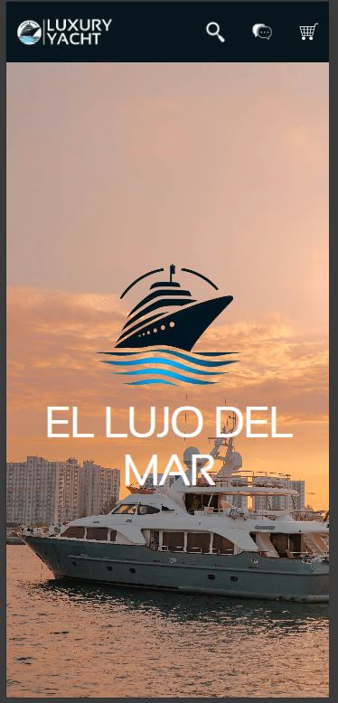
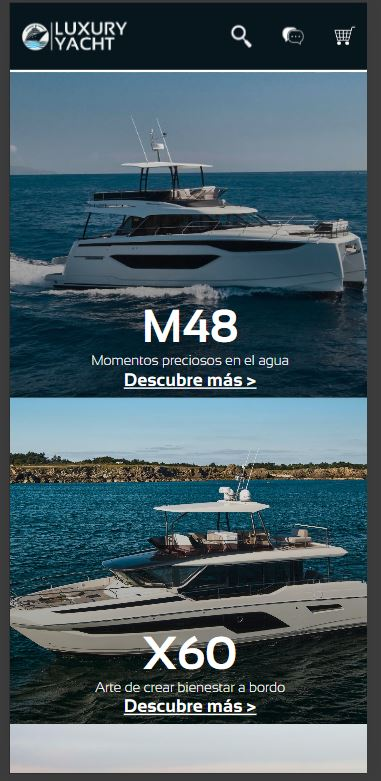
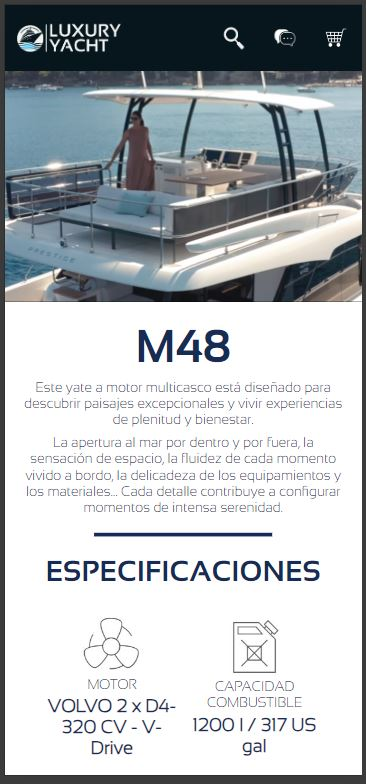
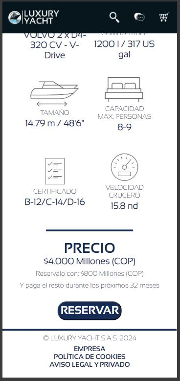
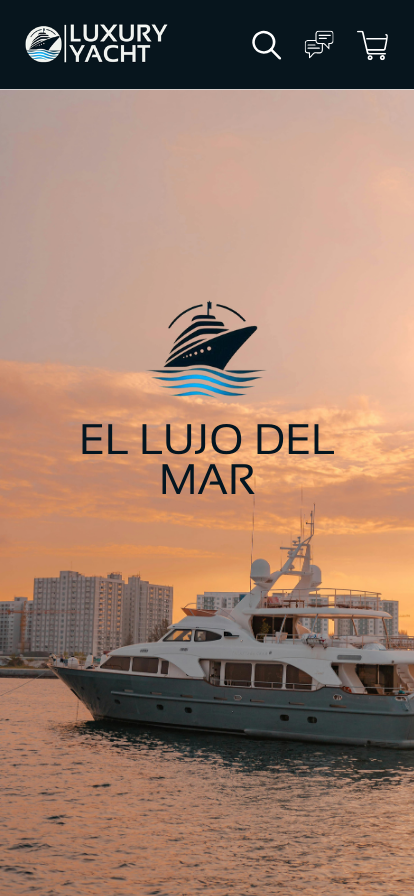
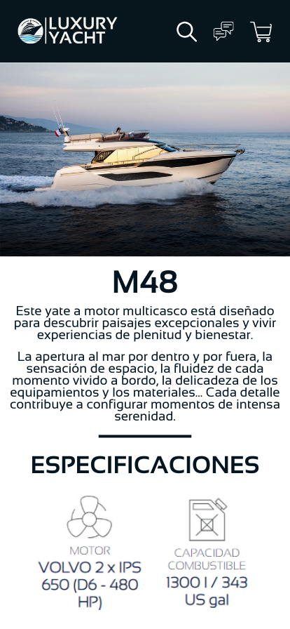
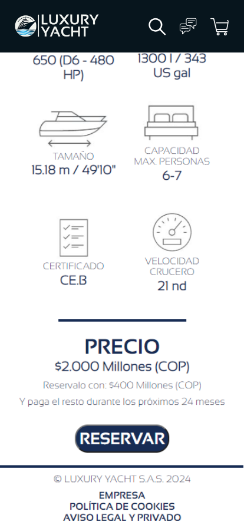

# Luxury Yacht Website

Este repositorio contiene el código fuente del sitio web Luxury Yacht, diseñado para mostrar y vender yates de lujo.

## Capturas de Pantalla

### Página Principal

### Página de Yate

### Página de Carrito de Compras

## Visión General

El sitio web Luxury Yacht permite a los usuarios explorar una variedad de yates de lujo y realizar compras en línea. Cuenta con secciones detalladas para cada modelo de yate, información técnica, precios y un carrito de compras integrado.

## Especificaciones Técnicas

- **HTML5**
- **CSS3**

## Uso

1. Clona este repositorio:
git clone https://github.com/nicolasm9808/PROYECTO-FILTRO_MENDEZLUIS_PALACIOSNICOLAS

2. Abre `index.html` en tu navegador web.

## Diseño Realizado

- Utilización de colores elegantes y fotografías de alta calidad para resaltar la experiencia de lujo.
- Diseño responsivo para adaptarse a dispositivos móviles.

### Diseño Inicial Realizado

## Instalación

No se requiere instalación adicional más allá de un navegador web estándar.

## Contribución

1. Fork del repositorio.
2. Crea una nueva rama (`git checkout -b feature/Mejora`).
3. Realiza cambios y haz commit (`git commit -am 'Añade mejoras'`).
4. Push a la rama (`git push origin feature/Mejora`).
5. Abre un Pull Request.